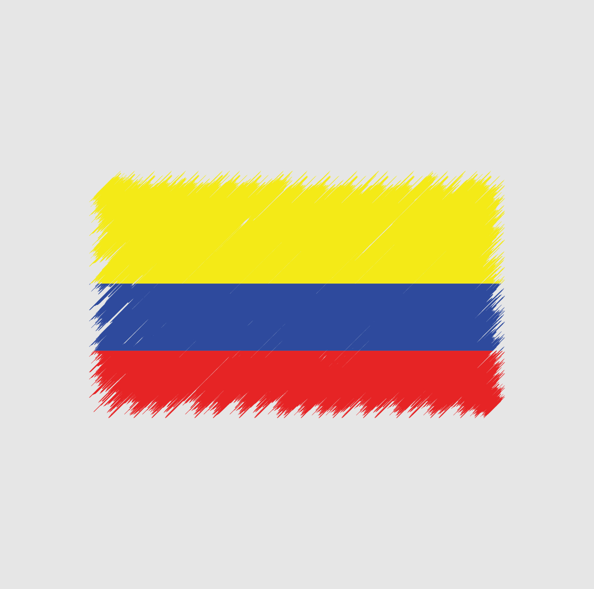

# Too Hot To Handle Team
HW#1 - GIT & GitHub ( Exploring Workflow Concepts )
## Chanya Chumdee TM#1
My name is Chanya Chumdee [ Yaya ], I'm from Thailand. I'm interested in web design, this is a link to my [personal site](https://ychanya.github.io/Personal-site/).

### Hobbies
- Travelling
- Take a picture
- Go to the park
- Music
- Lego collection

### Likes
- Natural lover
- Horror movies
- A dog person
- Bubble tea
- Spicy food

### Skills
- HTML
- CSS
- Management

### Contact
- E-mail : ya.chumdee@gmail.com

## Juliana Gambuzza TM#2
*My name is Juliana Gambuzza
I'm from Colombia* 

### I love sports, I play:
- Tennis 
- Volleybal
- Under Water Hockey 
    - I know it is a weird sport that no one have heard about.
    - [Video of what is under water hockey](https://www.youtube.com/watch?v=SAukrpTEvZA) 

 ### My hobbies are 
1. cook, I love to prepare Colombian dishes.
2. Travel to new cities, towns, contries.
3. Watch movies and shows.
4. Play boardgames with my family and friends.

### My skills 
- Creativity 
- Problem solving 
- Adaptability 
- Empathy 
- Supportive 

### What I like
- Create and design things 
- Read 
- Watch movies 
- Music
- Quality time with people I love 

## Contributing
1. Fork it!
2. Create your feature branch: git checkout -b my-new-feature
3. Commit your changes: git commit -am 'Add some feature'
4. Push to the branch: git push origin my-new-feature
5. Submit a pull request 

## Credits
1. Chanya Chumdee
2. Juliana Gambuzza

## License
MIT